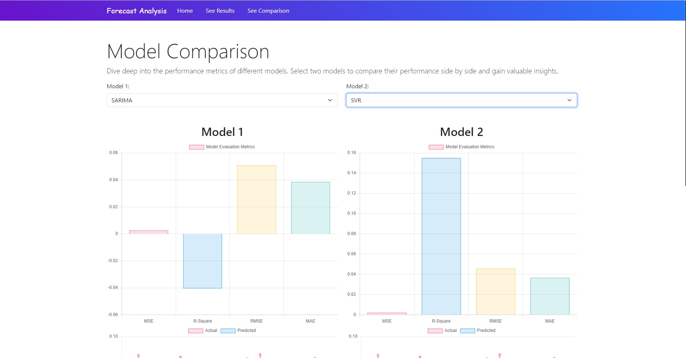
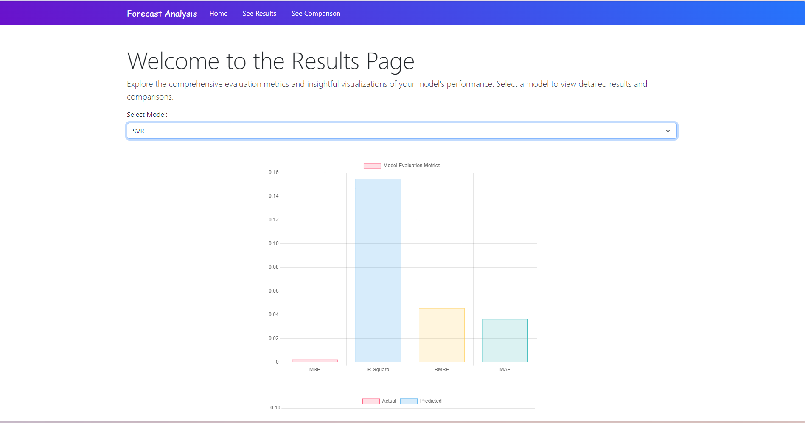
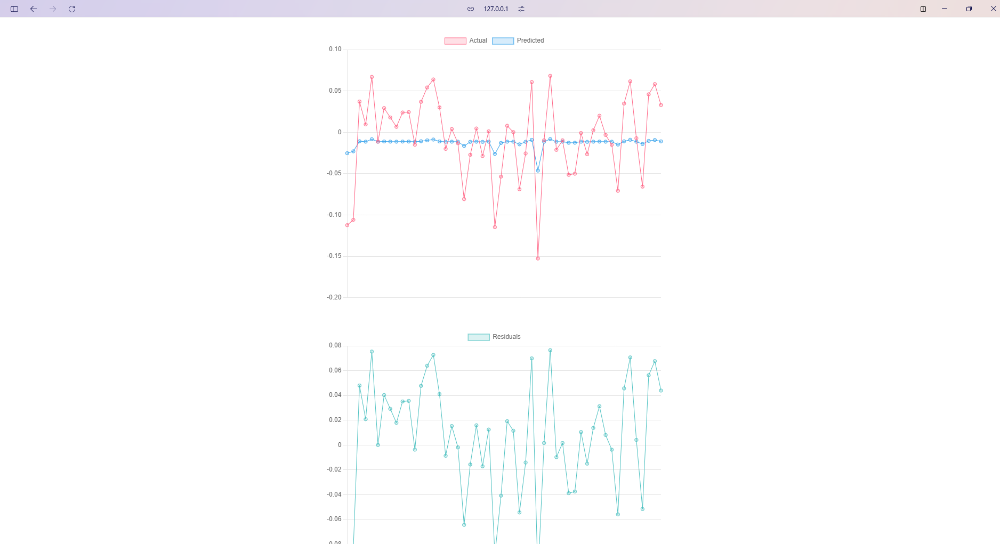
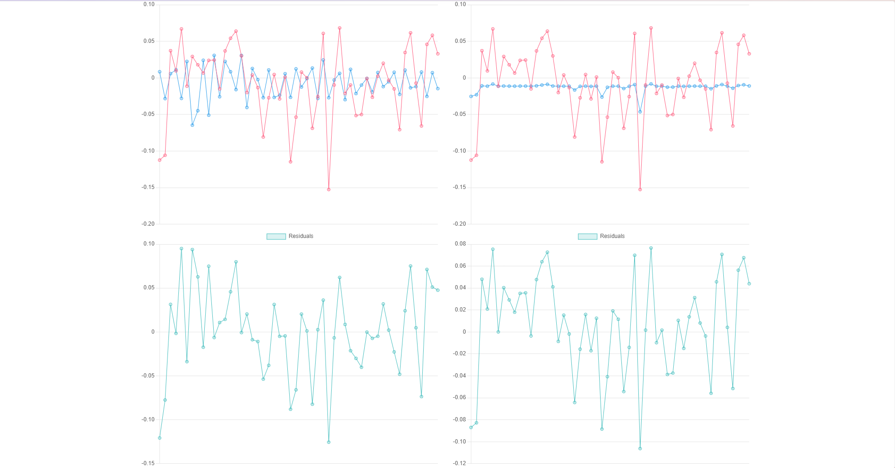

# Forecast Analysis Project 📊

Welcome to the Forecast Analysis project! This project aims to provide comprehensive evaluation metrics and insightful visualizations of different forecasting models.

## Overview ℹ️

The project leverages Flask as the backend framework and integrates various data analysis and visualization libraries such as Chart.js for frontend visualization, SQLite for database management, and scikit-learn for model evaluation.

## Features ✨

- Landing Page with project overview
- Results Page to explore evaluation metrics and visualizations
- Model Comparison Page to compare performance metrics of different models

## Screenshots 🖼️

- Landing Page
  

- Results Page
  

  

- Model Comparison Page
  
  

## How to Run 🚀

1. Clone the repository:

   ```bash
   git clone https://github.com/your_username/forecast-analysis.git
   ```

2. Install dependencies:

   ```bash
   pip install -r requirements.txt
   ```

3. Run the Flask app:

   ```bash
   python app.py
   ```

4. Open your web browser and go to [http://localhost:5000](http://localhost:5000) to view the application.

## Contributing 🤝

Contributions are welcome! If you have any suggestions, feature requests, or want to report a bug, please open an issue or submit a pull request.

## License 📝

This project is licensed under the MIT License.
